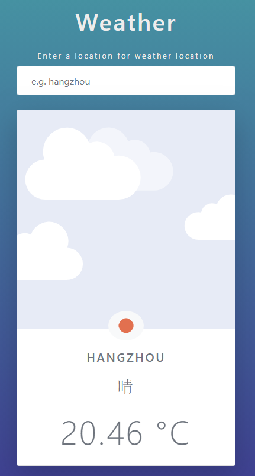

## Weather_app
该项目的主要目的是构建一个实时天气应用程序，该应用程序允许用户搜索城市并显示此城市当前的时刻天气和温度。中间的小图标也会根据当前城市天气而改变。
用到了openweathermap.org提供的API获取城市信息和天气图标。

### About
The Main objective of this project was to build a real time weather app that allows users to search a city's location and display its weather and temperature at that present moment 

### Aim
<ul>
  <li>A search bar that takes user input e.g.("city")</li>
  <li>takes that data and send a request to an weahter API.</li>
  <li>the returned data are then displayed on the DOM</li>
</ul>

### Technologies
<ul>
  <li>Html</li>
  <li>Bootstrap </li>
  <li>CSS</li>
  <li>Javascript</li>
  <li>https://openweathermap.org/api</li>
</ul>

### How to run
To run this project simply go to my Github repository and download all the files, click on index.html to get started!

### Project URL
This project is currently hosted at: https://snaxbox.github.io/weather_app/

